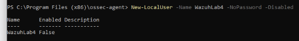

# Windows Account Creation and Deletion — Wazuh Lab 4

Author: Seth Jones  
Date: October 1, 2026  
Status: Completed controlled lab

## Objective and scope

Create a disabled temporary local account on the Windows 11 lab workstation, verify its creation in Wazuh 4.14, delete it, and verify the deletion. The isolated Proxmox workstation was the only target; no domain account was created and the domain controller was not used.

## Preparation

I kept the workstation logged in, opened Administrator PowerShell, and used the Wazuh Events dashboard with a Last 15 minutes time range. No reboot, sign-out, agent configuration edit, or additional tool installation was required.

## Controlled account creation

```powershell
New-LocalUser -Name WazuhLab4 -NoPassword -Disabled
```

PowerShell returned WazuhLab4 with Enabled set to False. The account was deliberately disabled and was not used to sign in. I searched Wazuh for:

```text
data.win.system.eventID:4720
```

The dashboard summary showed “User account enabled or created,” rule 60109, level 8, at October 1, 2026, 15:48:34.209 as displayed. The expanded event confirmed Event 4720, event record 87791, and samAccountName WazuhLab4. Its Subject identified the local lab administrator account that performed the operation. The combined rule label alone does not establish that the new account was enabled; the command output showed it was disabled.

Other nearby summary rows described an account change and a group change. Their full details were not investigated, so they are not claimed as separate validated lab results.

## Deletion and cleanup

```powershell
Remove-LocalUser -Name WazuhLab4
```

I searched Wazuh for:

```text
data.win.system.eventID:4726
```

The expanded alert confirmed targetUserName WazuhLab4, Event 4726, event record 87794, and the message “A user account was deleted.” The Subject identified the same local lab administrator account. The Windows event timestamp was 2026-10-01T19:54:51.3325571Z. The supplied deletion screenshots did not show the Wazuh rule ID or level, so these are not reported.

## Verified results

| Action | Account | Windows event | Event record | Wazuh evidence |
| --- | --- | --- | --- | --- |
| Creation | WazuhLab4 | 4720 | 87791 | Rule 60109, level 8; creator and account fields reviewed |
| Deletion | WazuhLab4 | 4726 | 87794 | Target and Subject fields reviewed; deletion message confirmed |

The deletion event verifies cleanup of the temporary account. No successful login, administrator group addition, account compromise, or automated containment was tested. The event Subject identifies an account used for the operation; it does not by itself prove which human controlled that account. Displayed dashboard time and Windows UTC time are retained as observed and are not used to measure detection latency.

## Investigation and disposition

Both operations matched my deliberate lab commands. Disposition: expected authorized lab activity; no incident containment required. Deleting the test account was planned cleanup, not a response to a real intrusion.

During the triage review, I identified the CAB/change request, confirmation with the administrator, and review of logs as the checks needed for unexpected account creation. I would compare the action with the approved purpose, timing, and permissions, and correlate the administrator session and subsequent account activity. An administrator performing an action does not establish authorization; that account could also be misused.

## Evidence and privacy

The private portfolio retains the supplied command output, creation summary, account fields, and deletion details. Public documentation omits workstation names, administrator account names, private IP addresses, and SIDs. The included command-output screenshot shows the test account and its disabled state; original identifying dashboard screenshots are not published here.



## Outcome

Verified local account creation and deletion in Wazuh, distinguished a combined alert description from the specific Windows event, reviewed the acting and target accounts, and discussed authorization checks. The temporary account was removed. No custom rules were created.
