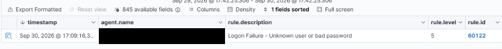
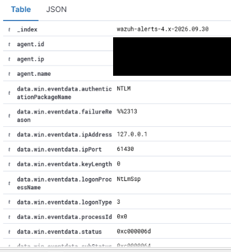
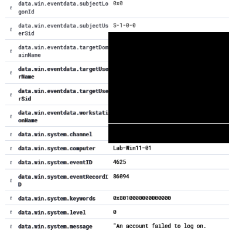
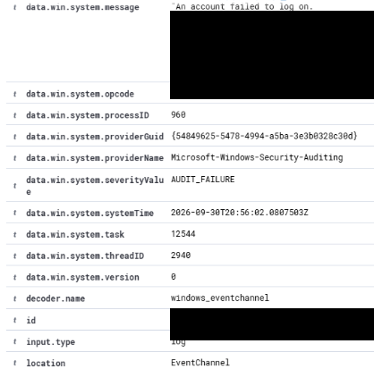
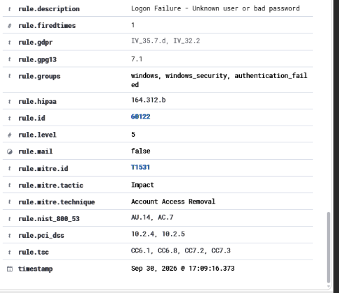
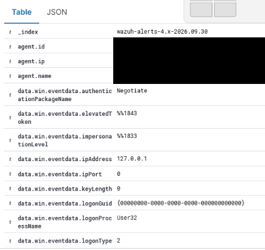
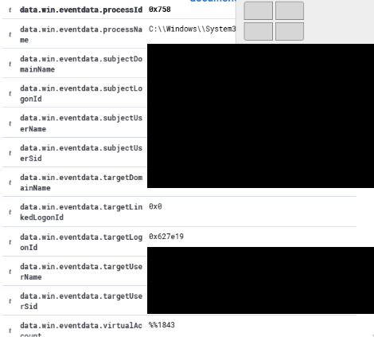
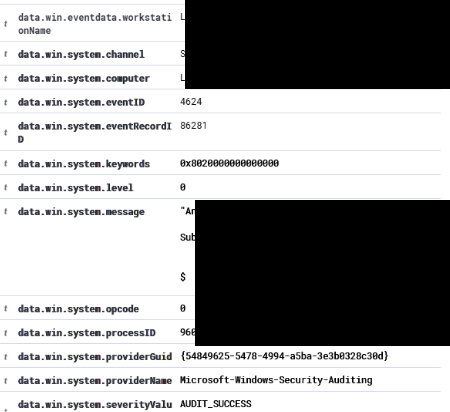
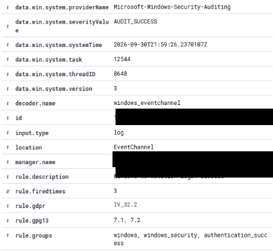
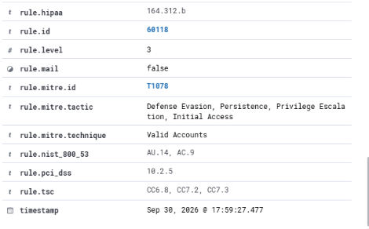

# Windows Authentication Detection and Alert Triage with Wazuh

Date: September 30, 2026  
Author: Seth Jones  
Status: Completed controlled lab

## Objective
Generate a controlled failed login, verify Windows endpoint logging, confirm Wazuh detection, and classify the resulting alert using evidence.

Identifying IP addresses, hostnames, account names, and security identifiers are redacted in this public version. Generic account and host labels are used in the narrative. The loopback address 127.0.0.1 is retained because it is not a unique network identifier and is relevant to the investigation.

## Environment
- Isolated Proxmox lab behind pfSense.
- VM 105: Windows 11 workstation LAB-WORKSTATION; Wazuh agent LAB-AGENT (agent ID redacted), IP [REDACTED ENDPOINT IP].
- VM 106: Wazuh 4.14 SIEM, dashboard at [REDACTED SIEM IP], accessed from the lab workstation.
- The domain controller was not a test target in this exercise.

## Operational recovery before investigation
The Wazuh VM was initially stopped. After it started, manager and dashboard were active, but the indexer failed to complete startup. Service status reported a startup timeout and status 143. Available disk space was about 60 GB (19% used); available memory was about 3.0 GiB, with swap unused. A subsequent start attempt also failed.

The configured startup allowance was confirmed as 1 minute 30 seconds:

```bash
systemctl show wazuh-indexer -p TimeoutStartUSec
```

A systemd drop-in was created at `/etc/systemd/system/wazuh-indexer.service.d/override.conf`:

```ini
[Service]
TimeoutStartSec=10min
```

Systemd was reloaded and the indexer started:

```bash
sudo systemctl daemon-reload
sudo systemctl start wazuh-indexer
sudo systemctl is-active wazuh-indexer
```

The indexer subsequently reported `active`, and the dashboard was accessible. This records service recovery by extending the startup allowance. Slow storage or recovery after the host power cycle may have contributed, but the underlying delay was not established. This was not a Wazuh data reset, reinstall, or proof of index corruption. Recovery steps are recorded from the session; the attached screenshots substantiate the detection.

## Controlled event generation
The test used a nonexistent account to attempt authentication to the workstation's own SMB service:

```powershell
net use \\127.0.0.1\IPC$ "WrongPassword123!" /user:"$env:COMPUTERNAME\TEST-ACCOUNT"
```

Windows returned System error 1326. The password above is a deliberately invalid test string, not a real credential. The failed event was verified on the endpoint:

```powershell
Get-WinEvent -LogName Security -FilterXPath "*[System[(EventID=4625)]]" -MaxEvents 1 | Format-List TimeCreated,Id,Message
```

The dashboard search used a 24-hour range:

```text
data.win.system.eventID:4625 AND data.win.eventdata.targetUserName:"TEST-ACCOUNT"
```

## Verified detection
| Field | Observed value |
|---|---|
| Event ID | 4625 — failed logon |
| Computer | LAB-WORKSTATION |
| Target account | TEST-ACCOUNT |
| Agent | LAB-AGENT / [REDACTED] |
| Agent IP | [REDACTED ENDPOINT IP] |
| Source IP | 127.0.0.1 |
| Logon type | 3 — network |
| Authentication | NTLM |
| Status | 0xC000006D |
| Wazuh rule | 60122 — Logon Failure - Unknown user or bad password |
| Alert level | 5 |
| Event record ID | 86094 |
| Windows event time | 2026-09-30T20:56:02.0807503Z |
| Alert timestamp displayed | September 30, 2026, 17:09:16.373 |

The Windows timestamp and dashboard timestamp are retained as shown. They should not be used to calculate ingestion latency without confirming timezone settings and clock synchronization.

## Investigation and disposition
The account, endpoint, source address, and failure details matched the deliberately generated test. The loopback source indicates a local origin; logon type 3 reflects the network authentication mechanism, even though the destination was the same workstation.

Disposition: expected authorized lab activity; no containment required. A local source alone does not establish benign activity. An unexpected alert would warrant review of timing, repeated attempts, targeted accounts, originating processes, and related successful logons such as Event 4624.

The rule's built-in MITRE label is metadata, not proof of the labeled behavior. The failed-login test did not demonstrate Account Access Removal, brute force, account compromise, successful access, or containment.

## Evidence










## Outcome
Successfully demonstrated controlled failed authentication, endpoint event verification, Wazuh detection, and basic alert triage. Also documented an indexer startup timeout and subsequent service recovery. No custom detection rule was created. Broader incident-response exercises remain future work.

## Successful-login detection — Lab 2
After signing out and signing back into LAB-WORKSTATION as LAB-USER, the successful interactive logon was verified in the Wazuh dashboard. A broad Windows query returned a SYSTEM service logon (type 5); that event was not used as evidence of the user's sign-in. The Wazuh record below identifies the actual LAB-USER interactive logon.

| Field | Verified value |
|---|---|
| Account | LAB-USER |
| Account domain | LAB-WORKSTATION |
| Windows event | 4624 — successful logon |
| Logon type | 2 — interactive |
| Source address | 127.0.0.1 |
| Authentication package | Negotiate |
| Logon process | User32 |
| Event record ID | 86281 |
| Windows event time | 2026-09-30T21:59:26.2370107Z |
| Dashboard alert time displayed | September 30, 2026, 17:59:27.477 |
| Wazuh rule | 60118 — Windows Workstation Logon Success |
| Alert level | 3 |

The account, local source, logon type, and timing were consistent with the deliberate sign-in. Disposition: expected authorized lab activity; no containment needed. A successful logon alone does not establish authorization. Unexpected activity requires checking account ownership, source, timing, and surrounding events. The rule's Valid Accounts / T1078 mapping is metadata, not evidence of credential abuse.

## Failed versus successful authentication
| Dimension | Lab 1: failed login | Lab 2: successful login |
|---|---|---|
| Account | TEST-ACCOUNT (nonexistent test account) | LAB-USER |
| Windows event | 4625 | 4624 |
| Mechanism | Local SMB authentication attempt | Console sign-out and sign-in |
| Logon type | 3 — network | 2 — interactive |
| Source | 127.0.0.1 | 127.0.0.1 |
| Authentication package | NTLM | Negotiate |
| Wazuh rule | 60122 | 60118 |
| Alert level | 5 | 3 |
| Disposition | Expected controlled test | Expected controlled test |

These were separate tests using different accounts and logon mechanisms. They do not demonstrate a failed-then-successful intrusion sequence, brute force, stolen credentials, or compromise.

## Successful-login evidence











## Combined outcome
Verified failed and successful Windows authentication events in Wazuh, distinguished service logons from user logons, and classified both controlled exercises using contextual evidence. No custom rules or containment actions were tested.
