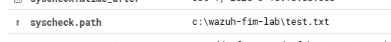
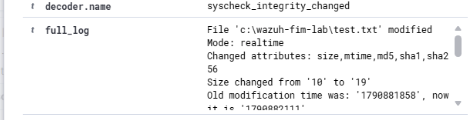
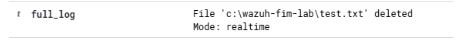

# Windows File Integrity Monitoring — Wazuh Lab 3

Author: Seth Jones  
Date: October 1, 2026  
Status: Completed controlled lab

## Objective

Configure Wazuh to monitor a dedicated Windows test folder and verify detection of file creation, modification, and deletion. Review the evidence without treating every change as malicious.

## Environment and scope

Wazuh 4.14 monitored a Windows 11 workstation in an isolated Proxmox lab. Testing was limited to `C:\Wazuh-FIM-Lab\test.txt`. The domain controller was not a target. Public documentation omits endpoint names and private network addresses.

## Configuration and recovery

Before editing, I backed up `C:\Program Files (x86)\ossec-agent\ossec.conf` as `ossec.conf.fim-backup` and created the test folder. Inside the existing `<syscheck>` section, below `<disabled>no</disabled>`, I added:

```xml
<directories realtime="yes" check_all="yes">C:\Wazuh-FIM-Lab</directories>
```

After the first edit and restart, `WazuhSvc` remained stopped. The agent log reported error 1226: `Error reading XML file 'ossec.conf': (line 0)`. The exact cause was not established.

I restored the backup and started the service; it reported Running. I then reapplied the directory entry and checked the saved XML in PowerShell:

```powershell
[xml](Get-Content .\ossec.conf -Raw) | Out-Null
```

The check returned without an error. After restarting, the service again reported Running. The later alerts confirmed monitoring of the test folder. The PowerShell check verified XML parsing, not every Wazuh configuration requirement. This recovery restored the agent configuration; it did not reset Wazuh data or reinstall the agent.

## Controlled test commands

I ran each command separately and checked the corresponding dashboard event before proceeding:

```powershell
Set-Content C:\Wazuh-FIM-Lab\test.txt 'FIM test'
Add-Content C:\Wazuh-FIM-Lab\test.txt 'Changed'
Remove-Item C:\Wazuh-FIM-Lab\test.txt
```

## Verified results

| Action | Observed evidence | Rule / level |
| --- | --- | --- |
| Create | “File added to the system”; `syscheck.path` matched `c:\wazuh-fim-lab\test.txt` | 554 / 5 |
| Modify | “Integrity checksum changed”; full log identified the test file, realtime mode, and changed size, mtime, MD5, SHA-1, and SHA-256 attributes | 550 / 7 |
| Delete | Full log identified `c:\wazuh-fim-lab\test.txt` as deleted in realtime mode | Not captured in supplied deletion screenshot |

The modification increased file size from 10 to 19 bytes. Exact before/after hash values were not captured in the supplied screenshot, so they are not reproduced here. Dashboard summary times displayed October 1, 2026, 15:10:58.605 for creation and 15:15:11.728 for modification. These are displayed timestamps, not measured detection latency; timezone settings and clock synchronization were not validated. A deletion timestamp was not captured.

## Investigation and disposition

All three events matched my deliberate file operations. Disposition: expected authorized lab activity; no containment required. The test file was deleted as the final test and cleanup. The monitoring folder and configuration entry remain in place.

For an unexpected production alert, I would inspect the file's purpose and what changed, establish when it happened, correlate user logons and process activity to investigate who changed it and how, and compare the activity with an approved change or maintenance window. I would assess impact and preserve relevant evidence before deciding on escalation or containment.

The captured FIM evidence identifies file changes but does not establish the responsible user or process. A checksum change alone does not prove malware, compromise, or an unauthorized action. This lab did not test actor attribution, malware detection, automatic response, or file restoration.

## Evidence

Public evidence uses the supplied detail screenshots that show only the test path and change information; endpoint summary screenshots are retained on the private portfolio.







## Review and outcome

During the scenario review, I identified the main triage questions: what changed, when, who made the change, and how it happened. We discussed correlating other logs and checking authorization because the captured file alerts alone do not answer every question.

Successfully configured a dedicated realtime monitoring folder, recovered from an unreadable agent configuration using a backup, and verified creation, modification, and deletion of the same test file in Wazuh. No custom rules were created.
